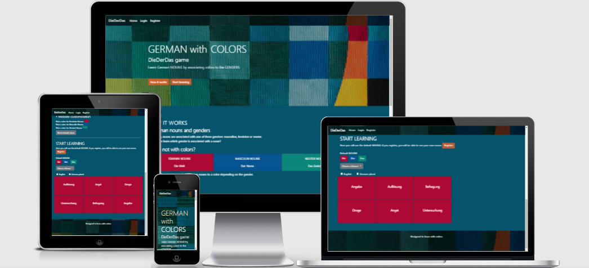
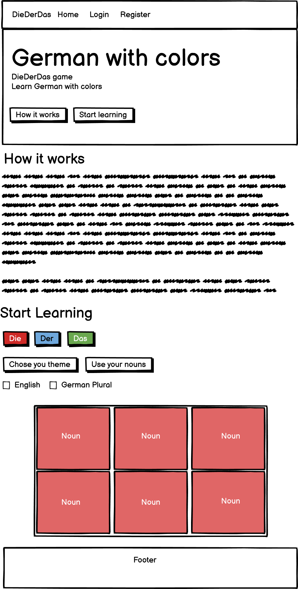
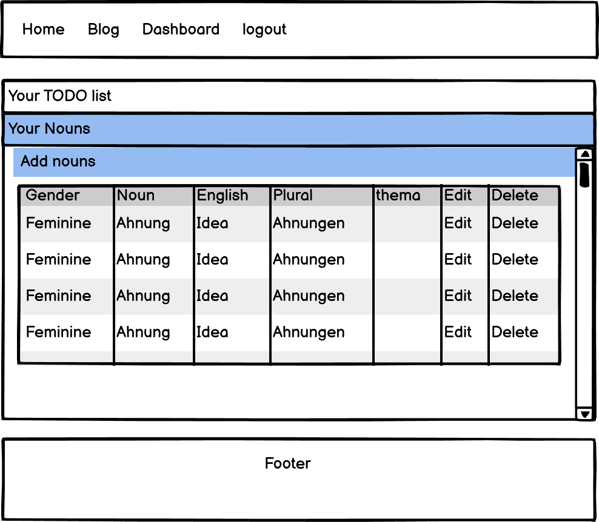
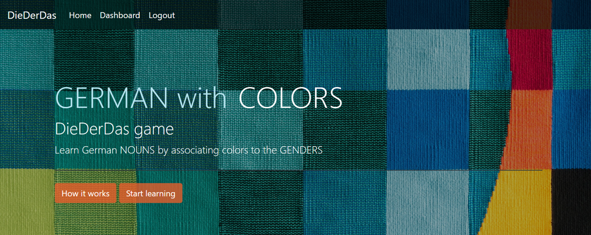
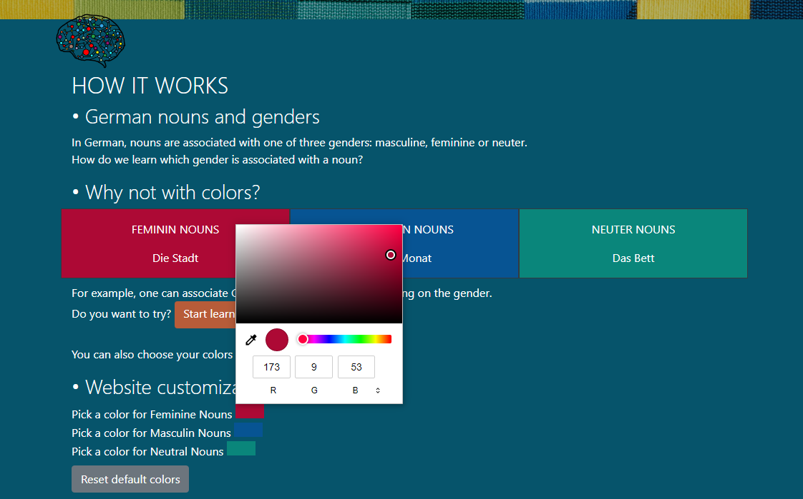
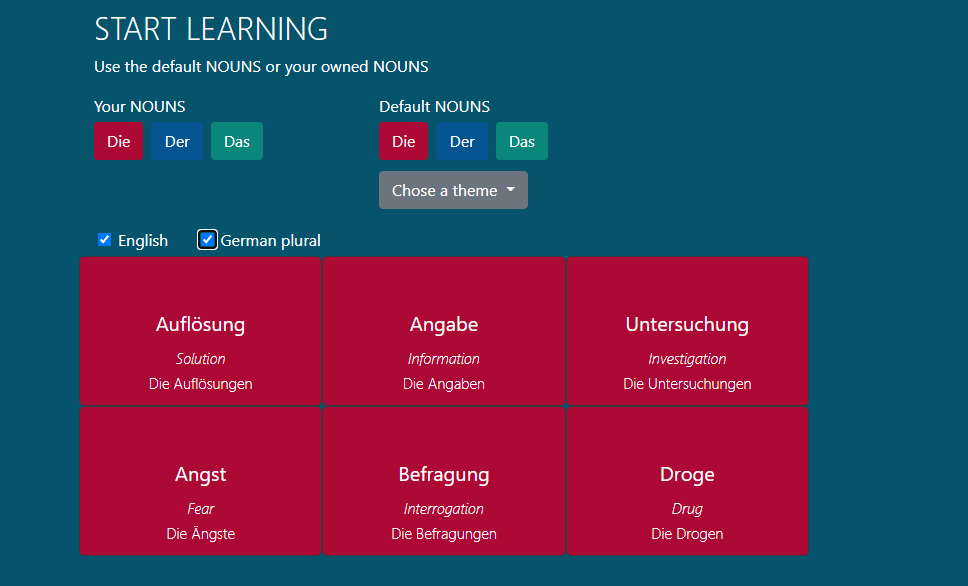
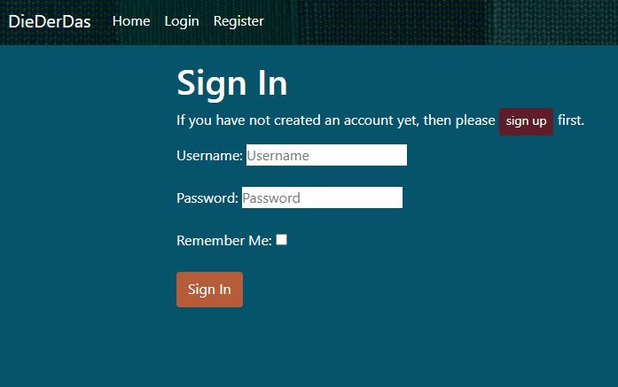
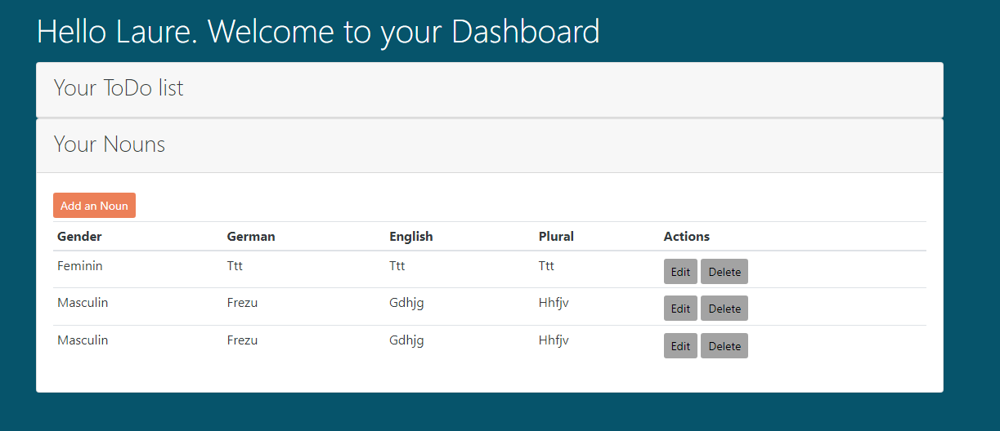
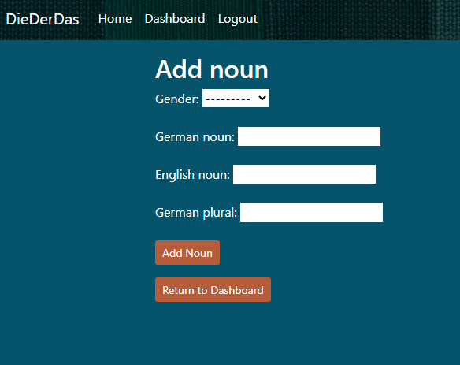

<h1 align="center"> Project 4 for Code Institute formation | DieDerDas | HTML - CSS - JS - DJANGO</h1>

[View the live project here.](https://project4-german-in-color.herokuapp.com/)

DieDerDas is a website to learn the gender of German nouns with colors. It's an original idea I had 2 years ago when I started learning German and I made a first prototype of the site in 2020 (which is no longer online). 

In this version, users can log in and interact with the database to enter their own set of nouns or they can use the default nouns.


This project is built as part of a project for the [code institute](https://codeinstitute.net/) (training to become a web developer). 

<h3 align="center"></h3>

# Table of content
<details>
<summary>Open the Table of Contents here</summary>

[About The Project](#about-the-project) 

[Target audience](#target-audience)  

[User Experience](#user-experience)
- [User stories](#user-stories)
- [Design](#design)

[Features](#features)  


[Technologies used](#technologies-used)
- [Languages used](#languages-used)
- [Frameworks and Programs used](#frameworks-and-programs-used)

[Tests](#tests)


[Deployment](#deployment) 
- [GitHub Pages](#github-pages)
- [Making a Local Clone](#making-a-local-clone)

[Credits](#credits)


[Acknowledgments](#acknowledgments)

</details>

# Background to understand the purpose of the website
In German, nouns are associated with one of three genders: masculine, feminine or neuter.

It leads to the question: 
How do we learn which gender is associated with a noun?

## Aim of the project
Create a website to help the user learn German nouns by associating colors to the nouns.

## Target audience
Learners of German, especially those who want to improve their knowledge of German Nouns genders. 


# User Experience
## Visitor Goals
- ### First Time Visitor Goals
  - As a First Time Visitor, I want to easily understand the main purpose of the site.
  - As a First Time Visitor, I want to easily understand how the learning works.
  - As a First Time Visitor, I want to get motivation and inspiration.
  - As a First Time Visitor, I want to start playing/learning rapidly.
  - As a First Time Visitor, I want to learn and get motivation.
  - As a First Time Visitor, I want to be able to easily navigate throughout the site.
  - As a First Time Visitor, I want to access the site across a range of devices.

- ### Returning Visitor Goals
  - As a Returning Visitor, I want to be able to use my own Nouns.
  - As a Returning Visitor, I want to find how to contact the organisation with any questions I may have.

- ### Frequent User Goals
  - As a Frequent User, I want to organize my learning in the website.

## UI Design
- ### Fonts 
Default Font from bootstrap were kept, i.e :  Because it looks nice and it is and easy to read

- ### Colors
Colors were inspirided from the hero pictures.
ie:


## Wireframes

### Home page
<details>
<h3 align="center"></h3>
</details>

### Dashboard page
<details>
<h3 align="center"></h3>
</details>

# Data structure


# Features 

- ### Hero Section
An image with colors was used for the hero section to illustrate the theme of the site which aims to help learn German with colors.
An animation was made on the text, where "German with Colors" becomes "Learn with colors" when the mouse passes over it. The objective is to stimulate and interest the user.

Buttons to access sub-sections of the site are placed in the hero so that the user can quickly go to the desired place on the site.

<h3 align="center"></h3>

- ### How it works Section
The section explains the concept of the website without too much text to not bore the user. 

An example with animation has been created so that the user can understand the concept even without reading the text. 

The user can also customize the colors associated with each gender.
<h3 align="center"></h3>

- ### Start learning Section
The user can click on the buttons to start learning. If the user is registered, he/she has the possibility to use own nouns as well as the default nouns.
<h3 align="center"></h3>


- ### Register, Login, Logout Section
Users can register, log in and log out to access their own dashboard.
<h3 align="center"></h3>


- ### Dashboard Section
In the dashboard, the user can have a list of tasks, edit, toogle and delete the items.
The user can also enter, edit and delete nouns.
<h3 align="center"></h3>

- ### Add edit delete
<h3 align="center"></h3>

- ### Footer
The footer was kept simple, with a sentence and an email address for contact. Since no social media was created for this project, no links were added. The email address is real and I would receive inquiries.

## Responsiveness
The website is designed to be suitable for all devices. For example, the responsive navigation bar turns into a burger button for phone screens.

## Futur
The user can add its own categories, 
level of difficulties with the Nouns
When a noun is clicked, the card can turn and a sentence with the noun is written to help learning nouns in a context.

    
# Technologies used
## Languages used
- [HTML5](https://en.wikipedia.org/wiki/HTML5)
- [CSS3](https://en.wikipedia.org/wiki/Cascading_Style_Sheets)  
- [js](https://en.wikipedia.org/wiki/JavaScript)  
- [Python](https://en.wikipedia.org/wiki/Python_(programming_language))


## Frameworks
- [Bootstrap](https://getbootstrap.com/)

- [Django](https://www.djangoproject.com/)

- [GreenSock](https://greensock.com/)

- [jQuery](https://jquery.com/)

## Others

- [PostgreSQL](https://www.postgresql.org/) database used in development mode and database in production mode

- [Git](https://git-scm.com/) | used as version control system

- [Gitpod](https://gitpod.io/workspaces) | used to code, commit to git and push the codes to github

- [GitHub](https://github.com/) | used to store the project code, show it and deploy the website

- [Balsamiq](https://balsamiq.com/) |  used to create the wireframe

- [Powerpoint](https://simple.wikipedia.org/wiki/Microsoft_PowerPoint) | used to create images from screenshots

- [Word](https://en.wikipedia.org/wiki/Microsoft_Word) | used to correct the grammar

- [am I responsive?](http://ami.responsivedesign.is/) | used to look at the responsiveness of the website and to present an introductory picture in the readme file

- [W3C Markup Validation Service](https://validator.w3.org/) | used to check the validity of the HTML code

- [W3C CSS Validation service](https://jigsaw.w3.org/css-validator/) | used to check the validity of the CSS code

- [Chrome DevTools](https://developer.chrome.com/docs/devtools/) | used to inspect the elements, codes and to see the how the site look like on various phones and tablets

- [DeepL](https://www.deepl.com/) | used to translate words from French to English and to write the content of the website and the 'Read me' file

- [cloudinary]| used to store images

# Tests
## Code validation and issues found
The W3C Markup Validator and W3C CSS Validator Services were used to validate every page of the project to ensure there were no syntax errors in the project.
- [W3C Markup Validation Homepage | Results](https://validator.w3.org/nu/?doc=https%3A%2F%2Fproject4-german-in-color.herokuapp.com%2F)

- [W3C Markup Validation Login | Results](https://validator.w3.org/nu/?doc=https%3A%2F%2Fproject4-german-in-color.herokuapp.com%2Faccounts%2Flogin%2F)
- [W3C Markup Validation Register | Results](https://validator.w3.org/nu/?doc=https%3A%2F%2Fproject4-german-in-color.herokuapp.com%2Faccounts%2Fsignup%2F)
- [W3C Markup Validation Logout | Results](https://validator.w3.org/nu/?doc=https%3A%2F%2Fproject4-german-in-color.herokuapp.com%2Faccounts%2Flogout%2F)

- [W3C CSS Validator | Results](https://jigsaw.w3.org/css-validator/validator?uri=https%3A%2F%2Fproject4-german-in-color.herokuapp.com%2F&profile=css3svg&usermedium=all&warning=1&vextwarning=&lang=en)


Javascipt code was tested using [jshint](https://jshint.com/) and no error was found with /*jshint esversion: 6 */

## Testing User Stories

- ### First Time Visitor Goals
  - As a First Time Visitor, I want to easily understand the main purpose of the site.
    - The title DieDerDas + German with colors gives some indications about the purpose of the site and still in the Hero part, a sentence explains the purpose of the site "Learn German NAMES by associating colors with GENDERS".
  - As a First Time Visitor, I want to easily understand how the learning works.
    - An animation was made to explain how the website works and in the learning section, the user can click on buttons to see how it works with default nouns.
  - As a First Time Visitor, I want to get motivation and inspiration.
    - The colorful images have been placed in a way that stimulates the user and makes them feel surrounded by color.
  - As a First Time Visitor, I want to start playing/learning rapidly.
    - In the hero page, a button is placed to quickly access the learning section.
  - As a First Time Visitor, I want to be able to easily navigate throughout the site.
    - The navigation bar is fixed so that the user can always access the link it contains. The buttons are placed in such a way as to facilitate navigation on the site.
  - As a First Time Visitor, I want to access the site across a range of devices.
    - The site is designed for all devices

- ### Returning Visitor Goals

  - As a Returning Visitor, I want to be able to use my own Nouns.
    - The user can log in to use, add, modify and delete nouns.
  - As a Returning Visitor, I want to find how to contact the organisation with any questions I may have.
    - In the footer, an email address is provided so that the user can contact the website owner.

- ### Frequent User Goals
  - As a Frequent User, I want to organize my learning in the website.
    - A Todo section allows the user to organize his/her work.

## Test on browsers
The website was tested on computers using the browsers:
- [Google Chrome](https://en.wikipedia.org/wiki/Google_Chrome)
- [Firefox](https://en.wikipedia.org/wiki/Firefox) 
- [internet explorer](https://en.wikipedia.org/wiki/Internet_Explorer)
- [Microsoft edge](https://en.wikipedia.org/wiki/Microsoft_Edge)
- [Safary](https://en.wikipedia.org/wiki/Safari_(software))

## Test on devices
[Chrome DevTools](https://developer.chrome.com/docs/devtools/) was used to see how the site looks like on various phones and tablets. Additionally, after deployment the website was tested on various phones: iphone11, iphone10, Samsung Galaxy A3.


# Deployment
## GitHub Pages
The project was stored in GitHub and deployed in Heroku. Heroku Postgres was used for the database. Cloudinary to store the pictures.


## Making a Local Clone
- Log in to GitHub and locate the GitHub Repository.
- Click the Code drop down menu.
- Either download the ZIP file, unpackage locally and open with IDE OR to clone the repository using HTTPS, under "Clone with HTTPS", copy the link.
- Open Git Bash
- Change the current working directory to the location where you want the cloned directory to be made
- Type `git clone`, and then paste the URL you copied.
- Press Enter. Your local clone will be created.
- Create a file called env.py to hold your app's environment variables, which should contain the following:
```console
import os

os.environ["DATABASE_URL"] = "app database"
os.environ["SECRET_KEY"] = "app secret key"
os.environ["CLOUDINARY_URL"] = "cloudinary URL"

```
- Make sure the following are listed in your .gitignore file to prevent any environment variables being pushed publicly:
`env.py`


### Installing required softwares
In the terminal enter 

`pip3 install -r requirements.txt`

### Applying database migrations
In the terminal enter 
```
python manage.py migrate
```
### Creating a new superuser
```
python manage.py createsuperuser
```
### Creating a Default User
To be done just after the superuser creation so the id of the Default user will be 2 (important to use the default nouns).
Can be done in Admin.

### Entering Genders
Still in Admin, Add 3 genders. It is important to keep the following order:
1- Neutral
2- Masculin
3- Feminin

### Load categories and noun data from json file (found in home --> fixtures)
- load first categories by entering in the terminal:
`python3 manage.py loaddata categories`
- Then load the nouns by entering in the terminal:
`python3 manage.py loaddata nouns`

### The app can now be run locally using
```
python manage.py runserver
```

## Heroku Deployment
- Register or login [Heroku](https://id.heroku.com/login)
- Choose a unique name for the app and the location nearest to you.
- Under **Resources** search for and add **Heroku Postgres** to your app
- In your local environement in the env.py file, enter the database URL (to find the URL, in HEROKU go to settings --> click "Reveal Config VARS")
- In Heroku, add a SECRET_KEY var (must be the same as the one in your env.py file)
- Add the hostname of your Heroku app to settings.py
```
ALLOWED_HOSTS = ['YOUR-APP-NAME.herokuapp.com', 'localhost']
```
- In Heroku, select the **Deploy** tab and under **Deployment method** choose GitHub
- In **Connect to GitHub** enter your GitHub repository details and once found, click **Connect**
- under **Manual deploy** choose **Deploy Branch**

- The steps from the previous section have to be repeated to load data in the new database (can be done in the local environment):
  - Applying database migrations
  - Creating a new superuser
  - Creating an Default User
  - Entering Genders
  - Load categories and noun data from json file


# Credits

## Code credits
[code institute](https://codeinstitute.net/) - Parts of the code throughout the website have been adapted from the courses.


[w3schools](https://www.w3schools.com/) - Used throughout the project.

[stakocverflow](https://stakocverflow.com/) - Used throughout the project.


excel to json https://www.youtube.com/watch?v=eC95DrKMEo8 https://www.aconvert.com/document/xls-to-json/ https://beautifytools.com/excel-to-json-converter.php

## Read me file credits
https://github.com/farrelleoin93/12-acres-beer

## Pictures credits
Pictures were taken from [Pixabay](https://pixabay.com/) and [Unsplash](https://unsplash.com/).


# Acknowledgments
- My mentor, Nishant Kumar, for giving me the direction to start the project, for guiding me through the project, for giving me the idea to implement new features and for giving me feedback.

- Andras Raab for the suggestions to improve the design.

- The Slack community for clarifying certain concepts, sharing tips and links and, of course, for always helping me with the codes.

- Code institutes student care for giving me clear advice on the project when I was unsure of the theme and expectations.
