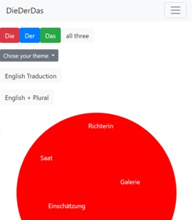
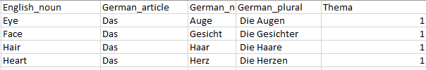
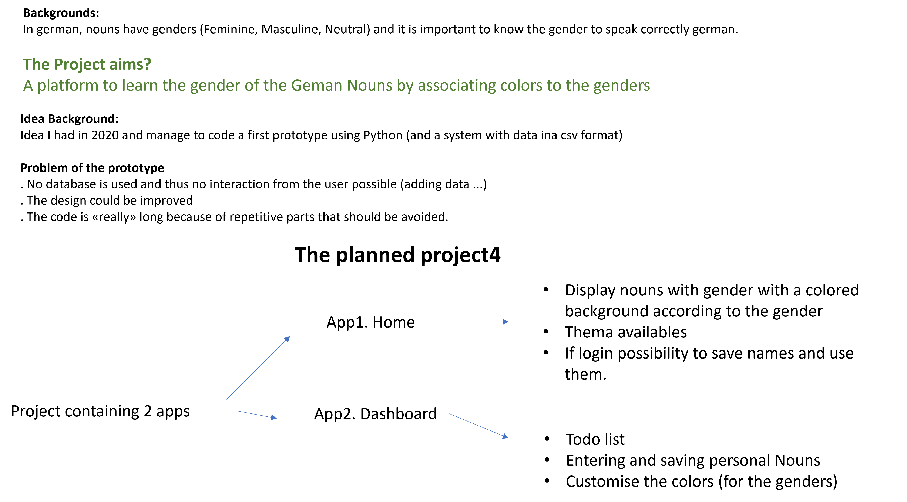
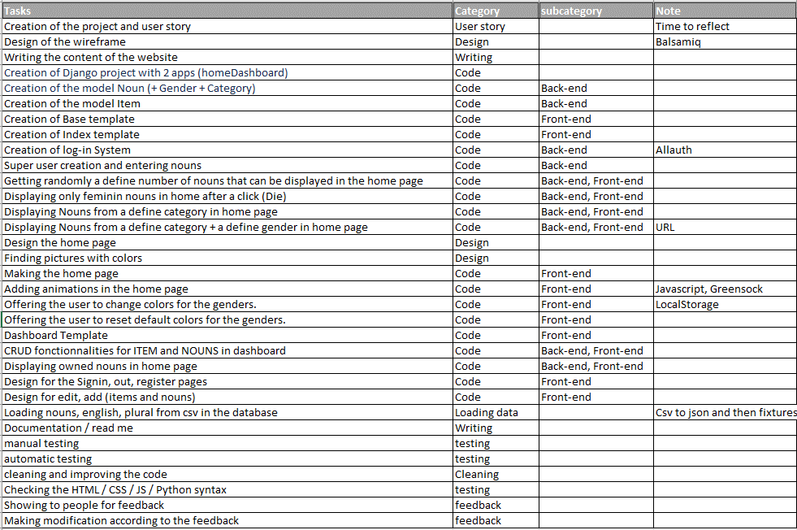
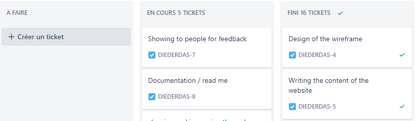
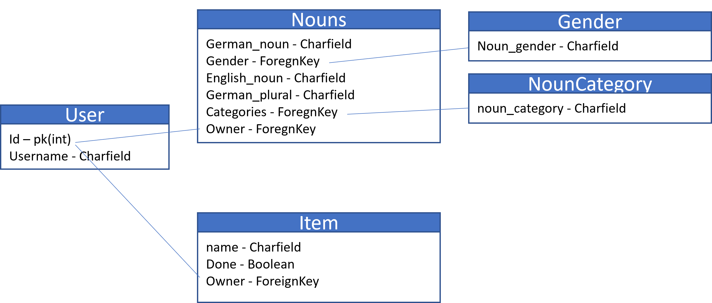

# User design evolution

## Origin of the idea
The idea of creating a website to learn vocabulary and especially the gender of nouns using colors comes from my own way of learning because colors and any available association help me a lot. When I started learning German, I tried to find apps or websites that offer to learn vocabulary using colors.

There are some great language learning apps that I have used and still use, but I haven't found one that allows the user to use the default nouns/vocabulary + their own set of nouns + choose the category + choose the colors.

So in 2020, I decided to code what I was looking for myself. 

The first version used python and csv files to organize the data.

### Prototype in 2020
<h3 align="center"></h3>

### Data organisation:
<h3 align="center"></h3>

## Project 4 planification
After checking with code institute student care that I could use a previous project (which had only been done by myself), I started planning the new project and the outline was presented to my mentor in a powerpoint format with the main idea in the following slide:
<h3 align="center"></h3>

From these outlines came the tasks to be accomplished:
<h3 align="center"></h3>

The tasks have also been entered into Jira, which makes it possible to follow the progress of the project. For a team project, Jira also allows you to work as a team on a project. 
<h3 align="center"></h3>

### Data model
Models were designed as the folling diagram:
<h3 align="center"></h3>

## Evolution of the design.
The design of the site evolved during the project as I received feedback from my friends, family, mentor. The picture of the hero was modified thanks to the discussion with friends. Then, the color theme of the site was inspired by the picture.
<h3 align="center"></h3>

The whole website was then redesigned to use these colors in order to have a certain homogeneity.

## Modification of the color picker
It was originally intended that the user could choose the custom colors in the dashboard. 
However, this has been changed and the colors can be customized by anyone, even without being logged in. This change was made because I realize that it would be better (from the user perspective) if everyone could change the colors.

